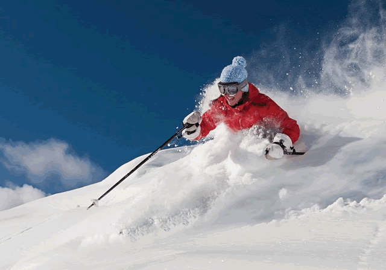

<b>SkiNet</b>
 
 

<i>"Using deep learning to predict the popularity of pictures from ski resorts"</i>
  

With the enormous popularity of social networks like LinkedIn, Facebook and Instagram, the online world plays a significant role in marketing campaigns. This study focuses on the promotion of ski resorts on Instagram. The official accounts of 80 US ski resorts have been analysed in order to predict the popularity of their pictures with the objective to optimize the use of their Instagram accounts in order to reach the most people.

A state-of-the-art Deep Convolutional Neural Network (DCNN) will be trained to classify the pictures and, together with additional describing features of both the resort and the pictures, will be used for the final prediction. In total over 75 thousand pictures have been used for transfer learning with the VGG architecture in order to optimize the predictions.

A baseline model, without any input from the pictures themselves, achieves an accuracy of 66% on a hold-out set. Adding newly engineered features from a DCNN increases the accuracy to 74% for exact predictions and 99% for predictions plus or minus one class.

</img> 

<i>Utah’s famous powder snow, a dream for many skiers but does such a picture get more likes? (© Snowbird, Utah)</i>

The code consists of the following steps:
<ol>
  <li>Collecting the links to all the pictures including the additional data like number of followers, data and time of post, etc.</li>
  <li>Scraping all the data except the pictures</li>
  <li>Scraping all the pictures</li>
  <li>Collecting latitude and longitude for every ski resort in this study based on addresses by using the Google API</li>
  <li>Creating resort specific features</li>
  <li>Creating picture specific features</li>
  <li>Exploring and visualizing the data</li>
  <li>Constructing the baseline model</li>
  <li>Cropping and resizing the pictures for later stages of the analysis</li>
  <li>Cluster analysis</li>
  <li>Selecting a random sample of pictures for the image classification</li>
  <li>Splitting the manually labeled images into a training -, validation - and test set</li>
  <li>Image classification based on Principal Components Analysis</li>
  <li>Image classification using deep learning</li>
  <li>Evaluation of the image classifier using deep learning</li>
  <li>Constructing the final prediction model</li>
</ol>

The code is written in Python 3.6.1

**Disclaimer**
-------------
The code on this repository only shows how to scrape data from Instagram and does in no way encourage people to scrape data. In case of SkiNet, data has been used only for non-commercial purposes. Using any provided code on this repository is entirely at your own risk!
